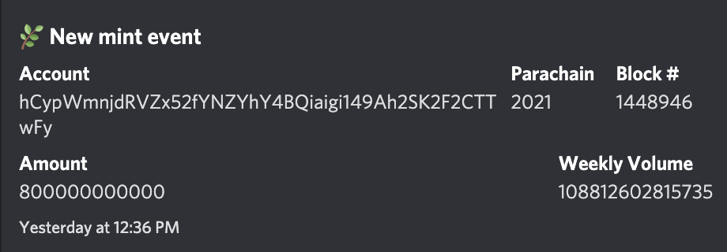

## bifrost-discord-bot



`bifrost-discord-bot` is a bespoke application that notifies (via Discord) about [Bifrost](https://bifrost.subscan.io/) minting and redemption events using Subquery GraphQL feed. Sponsored by Subquery [Grant Programme](https://subquery.network/grants), March 2022. 

`bifrost-discord-bot` doesn't use any custom Discord commands, and isn't programmed to react to mentions and DMs, so strictly speaking this is not a bot. Built using [Discord.js](https://discord.js.org/), [Nest](https://nestjs.com/), [GraphQL Codegen](https://github.com/dotansimha/graphql-code-generator). 

## Dependencies

`bifrost-discord-bot` requires [Bifrost Subquery Index](https://github.com/bifrost-finance/bifrost-subql) to be available, and there are two main reasons for this dependency. 

Firstly, the runtime dependency: the `bifrost-discord-bot` consumes the GraphQL API provided by the Bifrost Subquery Index. By default, the Subquery API is expected to be deployed to http://localhost:3000. 

Secondly: code dependency. To interact with the GraphQL API, the `bifrost-discord-bot` uses auto-generated type-safe client code `src/types.ts` (not pushed to Github for obvious reasons). To generate this client code, the schema provided by Bifrost Subquery Index is required. 

## Installation

```bash
$ npm install
```

## Configuration

Config file: [src/config.ts](./src/config.ts)

Obligatory environment variable `TOKEN` provides the value of your Discord bot user token. 

## Code Generation

```bash
$ npm run generate
```

## Running the app

Make sure the client code is generated as shown above. 

```bash
# development
$ TOKEN=<`DISCORD TOKEN`> npm run start

# watch mode
$ TOKEN=<`DISCORD TOKEN`> npm run start:dev

# production mode
$ TOKEN=<`DISCORD TOKEN`> npm run start:prod
```

## References

Subquery: https://subquery.network/

Bifrost: https://wiki.bifrost.finance/

Discord: https://discord.com/developers/docs/intro


## License

Nest is [MIT licensed](LICENSE).
